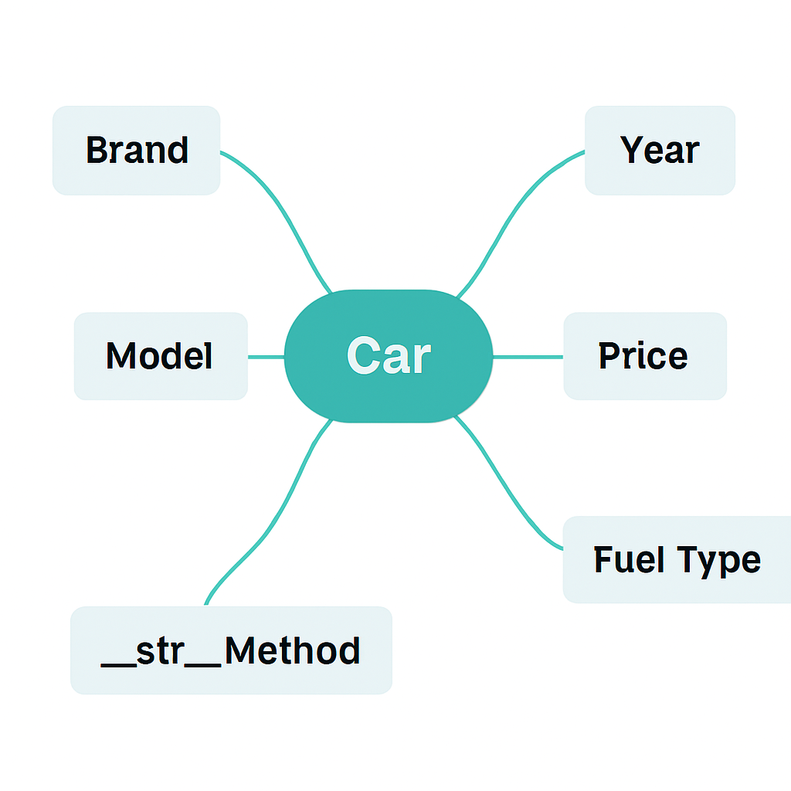
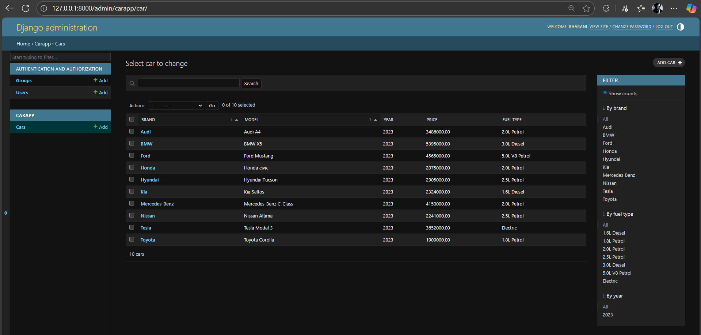

# Ex02 Django ORM Web Application
## Date: 

## AIM
To develop a Django application to store and retrieve data from Car Inventory Database using Object Relational Mapping(ORM).

## ENTITY RELATIONSHIP DIAGRAM



## DESIGN STEPS

### STEP 1:
Clone the problem from GitHub

### STEP 2:
Create a new app in Django project

### STEP 3:
Enter the code for admin.py and models.py

### STEP 4:
Execute Django admin and create details for 10 books

## PROGRAM


MODELS.PY

```
from django.db import models

class Car(models.Model):
    brand = models.CharField(max_length=100)
    model = models.CharField(max_length=100)
    year = models.IntegerField()
    price = models.DecimalField(max_digits=10, decimal_places=2)
    fuel_type = models.CharField(max_length=50)

    def __str__(self):
        return f"{self.brand} {self.model} ({self.year})"


```
ADMIN.PY
```

from django.contrib import admin
from .models import Car

admin.site.register(Car)

```

## OUTPUT



## RESULT
Thus the program for creating a database using ORM hass been executed successfully
